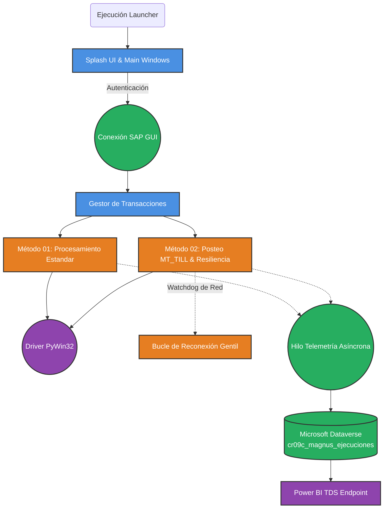

# Magnus RPA 🤖 - Entorno SAP & Dataverse


**Magnus RPA (Operaciones)** es un aplicativo avanzado de Automatización Robótica de Procesos desarrollado en Python, diseñado con una interfaz gráfica intuitiva mediante **PySide6**. Está diseñado específicamente para orquestar flujos de trabajo financieros corporativos de misión crítica, interactuando nativamente con **SAP ERP (GUI)** e integrando telemetría transaccional asíncrona hacia **Microsoft Dataverse / Dynamics CRM** para la generación de dashboards en Power BI.

Su propósito central es reducir la intervención manual en la conciliación y posteo de pagos masivos (capital y facturas), automatizando procesos en transacciones de caja y tesorería (como `/DBM/MT_TILL`), asegurando al mismo tiempo la gobernanza de datos y la resiliencia ante caídas de red.

---

## 🏗️ Arquitectura y Flujo del Sistema

El sistema implementa una arquitectura modular enfocada en la resiliencia transaccional y la separación de responsabilidades (Clean Architecture y MVC). El motor de SAP opera en hilos aislados, mientras que la telemetría se despacha de forma asíncrona.



---

## 📁 Estructura del Proyecto en Profundidad

La mantenibilidad del proyecto se rige por la siguiente estructura de directorios:

- 📂 **`/formularios/`**
  - Interfaces visuales generadas a través de Qt Designer (`.ui`) y compiladas en archivos `ui_*.py` (ej. `ui_operaciones.py`).
  - *Filosofía:* La capa de presentación se mantiene estrictamente declarativa.
- 📂 **`/metodos/`**
  - **El "Cerebro" Financiero del Bot**. Contiene la lógica de negocio y los envoltorios COM.
  - `sap_conexion.py`: Wrapper de PyWin32 para engancharse al proceso `saplogon.exe` y manipular sesiones de forma segura.
  - `metodo_01.py` & `metodo_02.py`: Algoritmos principales de procesamiento de datos en SAP. Incluyen lectura dinámica de ALV Grids, gestión de Popups anidados y la recuperación ante desconexiones de red.
  - `api_telemetria.py`: Driver OAuth2/MSAL que envía la data hacia la nube corporativa de Microsoft Dataverse usando especificaciones `OData v9.2`.
- 📂 **`/vistas/`**
  - **Controladores UI**. Vinculan los eventos (como el botón "Iniciar Proceso") con sub-hilos (`QThread` y `threading`) para evitar congelar la interfaz durante los posteos SAP o inyecciones de datos en la nube.
  - Destaca `operaciones.py` como el principal orquestador de señales y vistas.
- 📂 **`/config/`** & 📂 **`/configuraciones/`**
  - Configuración estructurada del comportamiento (Dataverse URLs, Tokens locales, credenciales encriptadas).
- 📄 **`mod_cierre.py`**
  - Rutina final que garantiza el cierre contable demostrativo y consolidación de montos procesados en la sesión actual.
- 📄 **`launcher.py`**
  - Punto de entrada (`entrypoint`). Configura la identificación del SO y lanza el Splash Screen.

---

## 🛡️ Aspectos de Seguridad y Despliegue

1. **Compilación de Código (Obfuscación / PyArmor):** 
   El sistema está diseñado para ofuscar métodos fundamentales (`metodo_01`, `metodo_02`, `sap_conexion`) impidiendo la alteración de reglas contables. El proyecto usa scripts como `compilar_exe.py` y `compilar_pyd.py` para transformar `.py` a binarios `.pyd` impenetrables.
2. **Telemetría Asíncrona (Non-blocking Dataverse):** 
   Para no afectar los milisegundos de ejecución en SAP, toda la data resultante viaja a Dataverse mediante un *Demonio* en segundo plano (`daemon=False`). La persistencia está asegurada con o sin internet temporal.
3. **Resiliencia SAP (Watchdog):** 
   Si el servidor de SAP corta la conexión (WSAECONNRESET), el Bot no muere, entra en un estado de pausa inteligente reintentando la conexión (`hay_internet()`) para retomar la fila de Excel exacta donde se quedó.

---

## 🚀 Guía de Instalación (Entorno de Desarrollo)

### 1. Prerrequisitos
- **Python 3.10 o superior**.
- Cliente SAP GUI instalado y habilitado para **Scripting** (RZ11 -> `sapgui/user_scripting` = TRUE).
- Microsoft Excel o compatibilidad con librerías `pandas` y `openpyxl`.

### 2. Configuración de Entorno Virtual
Se recomienda siempre levantar un entorno virtual:
```bash
python -m venv venv
venv\Scripts\activate
```

### 3. Instalación de Dependencias
Instale los paquetes Core:
```bash
pip install PySide6 pandas pywin32 msal requests
```

### 4. Ejecución en Modo Desarrollador
```bash
python launcher.py
```

### 5. Compilación a Producción (.exe)
Si requieres generar la versión empaquetada lista para distribución:
```bash
# 1. Compilar vistas de diseño Qt
python compilar_ui.py

# 2. Ofuscar los motores del RPA a binarios .pyd
python compilar_pyd.py

# 3. Compilar a un archivo de Instalación (.exe / InnoSetup)
python compilar_exe.py
```

---
*Diseñado bajo estándares de Clean Code, resiliencia de red y observabilidad corporativa orientada a SAP.*
